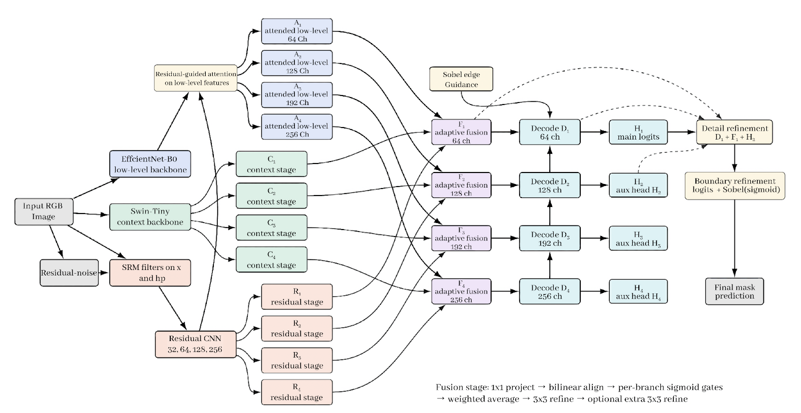

# NGIML

**NGIML (Noise-Guided Image Manipulation Localization)** is a deep learning framework for **forgery localization**. It predicts manipulated regions at the pixel level using a hybrid architecture built from **EfficientNet**, **Swin Transformer**, and **U-Net**, with **noise-guided features** to help surface subtle tampering artifacts.

This repository contains the model implementation and inference runtime for local use, plus a notebook workflow for running inference with pretrained checkpoints from Hugging Face.

This project is part of a **Bachelor's Thesis in Computer Science** from **Batangas State University - The National Engineering University (Alangilan Campus)**.

---

## Overview

NGIML is designed to localize image forgeries

Core ideas:

- **Noise-guided learning** to highlight low-level inconsistencies introduced by image manipulation
- **Hybrid feature extraction** using EfficientNet for local features and Swin Transformer for global context
- **Pixel-level decoding** with a U-Net-style decoder for dense localization output
- **Single-image inference** that produces probability maps, binary masks, and overlays

## Training Note

All pretrained models in this repository were trained **exclusively on [`CASIA v2`](https://github.com/namtpham/casia2groundtruth)**. Performance on other datasets or real-world images may vary and may require additional fine-tuning.

---

## Architecture



The model follows a multi-stage pipeline:

1. EfficientNet extracts low-level and mid-level visual features
2. Swin Transformer captures broader contextual relationships
3. Residual noise features provide manipulation-sensitive guidance
4. Feature fusion and U-Net decoding produce the final localization map

---

## Repository Contents

- [`predict.py`](./predict.py)  
  CLI entry point for running inference on a single RGB image

- [`src/runtime.py`](./src/runtime.py)  
  Checkpoint loading, preprocessing, inference, visualization, and export utilities

- [`src/model/`](./src/model/)  
  Model architecture, backbone definitions, feature fusion, and decoder modules

- [`infer.ipynb`](./infer.ipynb)  
  Notebook workflow for single-image inference with Hugging Face checkpoints

---

## Pretrained Checkpoints

Pretrained checkpoints are hosted on Hugging Face:

[juhenes/ngiml](https://huggingface.co/juhenes/ngiml)

Available checkpoints:

- `casia-effnet.pt`
- `casia-effnet+noise.pt`
- `casia-effnet+swin.pt`
- `casia-full.pt`
- `casia-swin.pt`
- `casia-swin+noise.pt`

Each file corresponds to a different model configuration.

## Running Inference in the Colab Notebook

Run the notebook in Colab using [`infer.ipynb` on Google Colab](https://colab.research.google.com/github/juhenes/ngiml-infer/blob/main/infer.ipynb).

---

## Running Inference Locally

For local inference, download one of the pretrained checkpoints from Hugging Face first, then install the required Python dependencies and run:

```bash
python predict.py --checkpoint /path/to/checkpoint.pt --image /path/to/image.png
```

Example using a checkpoint downloaded from Hugging Face:

```bash
python predict.py --checkpoint checkpoints_cache/casia-full.pt --image /path/to/image.png
```

Optional CLI arguments:

- `--output-dir` to choose where outputs are saved
- `--threshold` to override the default binary threshold
- `--normalization-mode` to set `imagenet` or `zero_one`
- `--resize-max-side` to resize large images before preprocessing
- `--crop-size` to override the inference crop size
- `--device` to choose a device such as `cpu` or `cuda:0`

If `--output-dir` is omitted, outputs are saved under `outputs/<image-stem>/`.

---

## Output Files

When an output directory is used, the runtime saves:

- `input_rgb.png`
- `preview_input_rgb.png`
- `preview_probability_map.png`
- `preview_binary_mask.png`
- `preview_overlay.png`
- `probability_map.png`
- `binary_mask.png`
- `overlay.png`
- `prediction.json`

`prediction.json` includes summary metadata such as the checkpoint path, threshold, normalization mode, device, and basic prediction statistics.

---

## Notes

- Intended for research and academic use
- Trained only on CASIA v2
- Generalization to other datasets may require fine-tuning

---

## License

This project is released under the license provided in [`LICENSE`](./LICENSE).

---

## References

1. Dong, J., Wang, W., and Tan, T. "CASIA Image Tampering Detection Evaluation Database." 2013 IEEE China Summit and International Conference on Signal and Information Processing, 2013. [DOI](https://doi.org/10.1109/chinasip.2013.6625374)

```bibtex
@inproceedings{Dong2013,
  doi = {10.1109/chinasip.2013.6625374},
  url = {https://doi.org/10.1109/chinasip.2013.6625374},
  year = {2013},
  month = jul,
  publisher = {{IEEE}},
  author = {Jing Dong and Wei Wang and Tieniu Tan},
  title = {{CASIA} Image Tampering Detection Evaluation Database},
  booktitle = {2013 {IEEE} China Summit and International Conference on Signal and Information Processing}
}
```

2. Pham, N. T., Lee, J.-W., Kwon, G.-R., and Park, C.-S. "Hybrid Image-Retrieval Method for Image-Splicing Validation." Symmetry, 11(1), 83, 2019.

```bibtex
@article{pham2019hybrid,
  title = {Hybrid Image-Retrieval Method for Image-Splicing Validation},
  author = {Pham, Nam Thanh and Lee, Jong-Weon and Kwon, Goo-Rak and Park, Chun-Su},
  journal = {Symmetry},
  volume = {11},
  number = {1},
  pages = {83},
  year = {2019},
  publisher = {Multidisciplinary Digital Publishing Institute}
}
```
